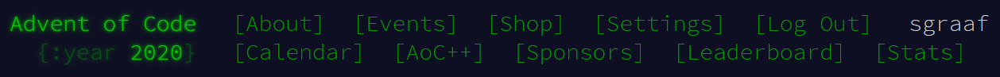

# 🎄 Advent of Code 2020 🌟

This repo contains my solutions for [Advent of Code 2020](https://adventofcode.com/2020/) in Python 🐍 using only the standard library. My solutions might not have the lowest possible computational complexity, but they should all feature good, clean Pythonic code.

The solution to each day's puzzle (along with any input) is stored in its own directory:
* [Day 1: Report Repair](./day01)
* [Day 2: Password Philosophy](./day02)
* [Day 3: Toboggan Trajectory](./day03)
* [Day 4: Passport Processing](./day04)
* [Day 5: Binary Boarding](./day05)
* [Day 6: Custom Customs](./day06)
* [Day 7: Handy Haversacks](./day07)
* [Day 8: Handheld Halting](./day08)
* [Day 9: Encoding Error](./day09)
* [Day 10: Adapter Array](./day10)
* [Day 11: Seating System](./day11)
* [Day 12: Rain Risk](./day12)
* [Day 13: Shuttle Search](./day13)
